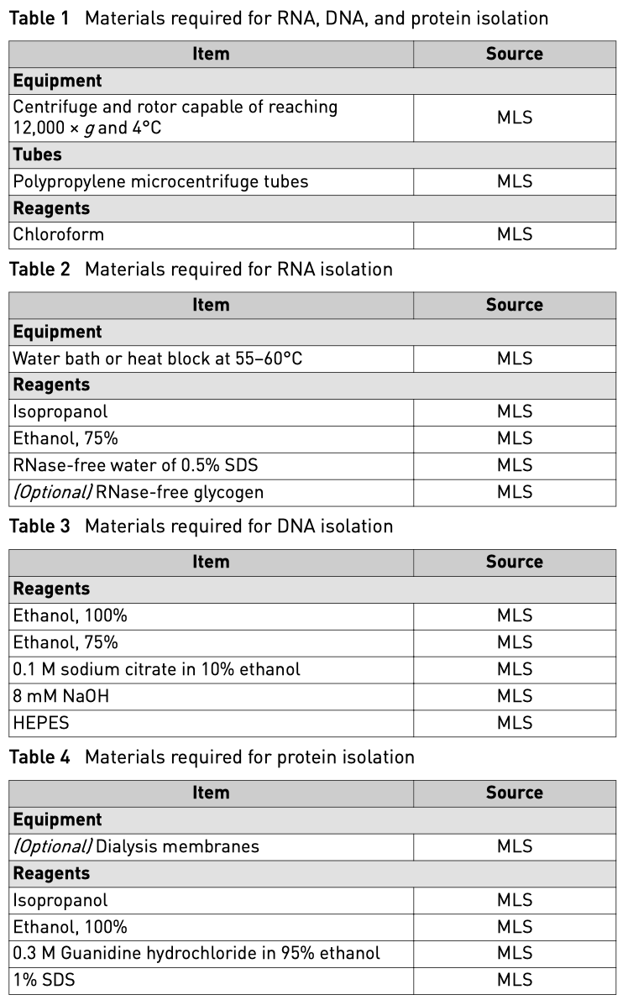
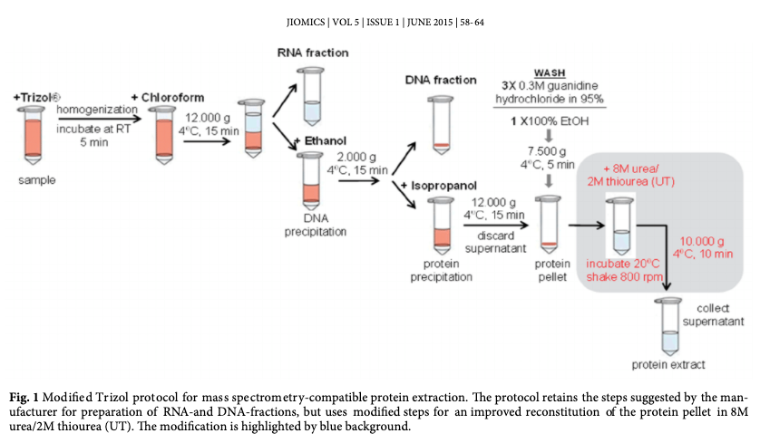
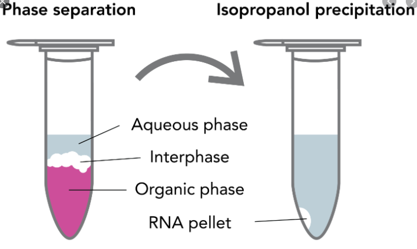

# DNA&RNA&Pro_co-isolation_from_plasma

## before start

**Reagent and equipment**

## pipeline

## procedure

### 1 Lyse samples and separate phases

11. Lyse and homogenize samples in TRIzol ™ Reagent according to your starting material.

* Tissues: 1 mL of TRIzol ™ Reagent per 50–100 mg

* Cell grown in monolayer: 0.3–0.4 mL of TRIzol ™ Reagent per 1 × 105—10 7cells

* Cells grown in suspension: 0.75 mL of TRIzol ™ Reagent per 0.25 mL of sample  
* **Saliva/serum/plasma/urine**: 1 mL of TRIzol ™ Reagent per 0.25-0.33 mL of sample

12. (**Optional**) If samples have a high fat content, centrifuge the lysate for 5 minutes at 12,000 × g at 4–10°C, then transfer the clear supernatant to a new tube.
13. Incubate for 5 minutes to permit complete dissociation of the nucleoproteins complex.
14. Add 0.2 mL of chloroform per 1 mL of TRIzol ™ Reagent used for lysis, then securely cap the tube.
15. Incubate for 2–3 minutes.
16. Centrifuge the sample for 15 minutes at 12,000 × g at 4°C.

> The mixture separates into a lower red phenol-chloroform, and interphase, and a colorless upper aqueous phase.

17. Transfer the aqueous phase containing the RNA to a new tube.

> For 333ul plasma + 1ml QIAZol, about 600ul aqueous phase, 700ul interphase and organic phase.

17. Transfer the aqueous phase containing the RNA to a new tube by angling the tube at 45° and pipetting the solution out.

> **IMPORTANT**! Avoid transferring any of the interphase or organic layer into the pipette when removing the aqueous phase.

### 2 Isolate RNA

21. Precipitate the RNA

    a. (**Optional**) If the starting sample is small (<10 6 cells or <10 mg of tissue), add 5–10 µg of RNase-free glycogen as a carrier to the aqueous phase.

> **Note**: The glycogen is co-precipitated with the RNA, but does not interfere with subsequent applications.

​	b. Add 1 (0.5) mL of isopropanol to the aqueous phase, per 1 mL of TRIzol ™ Reagent used for lysis.

> **Note**: isopropanol volume is more than whole volumn of aqueous phase

​	c. Incubate for 10 minutes.

​	d. Centrifuge for 10 minutes at 12,000 × g at 4°C.

​	e. Total RNA precipitate forms a white gel-like pellet at the bottom of the tube. Discard the supernatant with a micropipettor.

22. Wash the RNA

    a. Resuspend the pellet in 1 mL of 75% ethanol per 1 mL of TRIzol ™ Reagent used for lysis.

> **Note**: The RNA can be stored in 75% ethanol for at least 1 year at –20°C, or at least 1 week at 4°C.

​	b. Vortex the sample briefly, then centrifuge for 5 minutes at 7500 × g at 4°C.

​	c. Discard the supernatant with a micropipettor.

​	d. Vacuum or air dry the RNA pellet for 5–10 minutes.

> **IMPORTANT**! Do not dry the pellet by vacuum centrifuge. Do not let the RNA pellet dry, to ensure total solubilization of the RNA. Partially dissolved RNA samples have an A 230/280 ratio <1.6.

23. Solubilize the RNA

    a. Resuspend the pellet in 20–50 µL of RNase-free water, 0.1 mM EDTA, or 0.5% SDS solution by pipetting up and down.

> **IMPORTANT**! Do not dissolve the RNA in 0.5% SDS if the RNA is to be used in subsequent enzymatic reactions.

​	b. Incubate in a water bath or heat block set at 55–60°C for 10–15 minutes.

Proceed to downstream applications, or store the RNA at –70°C.

### 3 Isolate DNA

Isolate DNA from the interphase and the lower phenol-chloroform phase saved from “Lyse samples and separate phases“

31. Precipitate the DNA

    a. Remove any remaining aqueous phase overlying the interphase. This is critical for the quality of the isolated DNA.

    b. Add 0.3 mL of 100% ethanol per 1 mL of TRIzol ™ Reagent used for lysis.

    c. Cap the tube, mix by inverting the tube several times.

    d. Incubate for 2–3 minutes.

    e. Centrifuge for 5 minutes at 2000 × g at 4°C to pellet the DNA.

    f. Transfer the phenol-ethanol supernatant to a new tube. The supernatant is used for **protein isolation**

32. Wash the DNA

    a. Resuspend the pellet in 1 mL of 0.1 M sodium citrate (柠檬酸钠) in 10% ethanol, pH 8.5, per 1 mL of TRIzol ™ Reagent used for lysis.

    b. Incubate for 30 minutes, mixing occasionally by gentle inversion.

Note: The DNA can be stored in sodium citrate/ethanol for at least 2 hours.

​	c. Centrifuge for 5 minutes at 2000 × g at 4°C.

​	d. Discard the supernatant with a micropipettor.

​	e. Repeat step 2a–step 2d once.

Note: Repeat step 2a–step 2d twice for large DNA pellets (>200 µg).

​	f. Resuspend the pellet in 1.5–2 mL of 75% ethanol per 1 mL of TRIzol ™ Reagent used for lysis.

​	g. Incubate for 10–20 minutes, mixing occasionally by gentle inversion.

Note: The DNA can be stored in 75% ethanol at several months at 4°C.

​	h. Centrifuge for 5 minutes at 2000 × g at 4°C.

​	i. Discard the supernatant with a micropipettor.

​	j. air dry (or Vacuum) the DNA pellet for 5–10 minutes.

33. Solubilize the DNA

    a. Resuspend the pellet in 0.3–0.6 mL of 8 mM NaOH by pipetting up and down.

Note: We recommend resuspending the DNA is a mild base because isolated DNA does not resuspend well in water or Tris buffer.

​	b. Centrifuge for 10 minutes at 12,000 × g at 4°C to remove insoluble materials.

​	c. Transfer the supernatant to a new tube, then adjust pH as needed with HEPES.

Proceed to downstream applications, or store the DNA at 4°C overnight. For longer-term storage at –20°C, adjust the pH to 7–8 with HEPES and add 1 mM EDTA.

### 4 Isolate proteins

Isolate the proteins from the phenol-ethanol supernatant saved from “Precipitate the DNA“

41. Precipitate the proteins

    a. Add 1.5 mL of isopropanol to the phenol-ethanol supernatant per 1 mL of TRIzol ™ Reagent used for lysis.

    b. Incubate for 10 minutes.

    c. Centrifuge for 10 minutes at 12,000 × g at 4°C to pellet the proteins.

    d. Discard the supernatant with a micropipettor.

42. Wash the proteins

    a. Prepare a wash solution consisting of 0.3 M guanidine hydrochloride in 95% ethanol.

    b. Resuspend the pellet in 2 mL of wash solution per 1 mL of TRIzol ™ Reagent used for lysis.

    c. Incubate for 20 minutes.

Note: The proteins can be stored in wash solution for at least 1 month at 4°C or for at least 1 year at 20°C.

​	d. Centrifuge for 5 minutes at 7500 × g at 4°C.

​	e. Discard the supernatant with a micropipettor.

​	f. Repeat step 2b–step 2e twice.

​	g. Add 2 mL of 100% ethanol, then mix by vortexing briefly.

​	h. Incubate for 20 minutes.

​	i. Centrifuge for 5 minutes at 7500 × g at 4°C.

​	j. Discard the supernatant with a micropipettor.

​	k. Air dry the protein pellet for 5–10 minutes.

IMPORTANT! Do not dry the pellet by vacuum centrifuge.

43. Solubilize the proteins

    a. Resuspend the pellet in 200 µL of 1% SDS by pipetting up and down.

Note: To ensure complete resuspension of the pellet, we recommend that you incubate the sample at 50°C in a water bath or heat block.

​	b. Centrifuge for 10 minutes at 10,000 × g at 4°C to remove insoluble materials.

​	c. Transfer the supernatant to a new tube.

Proceed directly to downstream applications, or store the sample at –20°C.

### 4* Dialyse the proteins (OPTIONAL)

1. Load the phenol-ethanol supernatant into the dialysis membrane.

Note: The phenol-ethanol solution can dissolve some types of dialysis membranes (cellulose ester, for example). Test dialysis tubing with the membrane to assess compatibility before starting.

2. Dialyze the sample against 3 changes of 0.1% SDS at 4°C. Make the first change of solution after 16 hours, the second change 4 hours later (at 20 hours), and the final change 2 hours later (at 22 hours).

Note: A SDS concentration of at least 0.1% is required to resolubilize the proteins from the pellet. If desired, the SDS can be diluted after solubilization.

3. Centrifuge the dialysate for 10 minutes at 10,000 × g at 4°C.

4. Transfer the supernatant containing the proteins to a new tube.

5. (Optional) Solubilize the pellet by adding 100 µL of 1% SDS and 100 µL of 8 M urea.

Proceed directly to downstream applications, or store the sample at 20°C.

## reference 

1. TRIzol ™ Reagent manual, thermalfisher
2. Han, Int. J. Mol. Sci. 2019, Effect of Saliva Collection Methods on the Detection of Periodontium-Related Genetic and Epigenetic Biomarkers—A Pilot Study.
3. Improved reconstitution of Trizol derived protein extracts provides high quality samples for comprehensive proteomic characterization of cell cultures